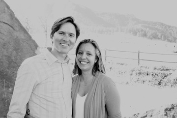

# Lyons, Colorado &mdash; 19 August 2018

  

    Boulder servirá de base para la celebración en Colorado, y les sugerimos que se
    hospeden allí. La ceremonia se llevará acabo en Lyons, un pueblito que queda a
    sólo 30 minutos al norte de Boulder, entre Boulder y Estes Park.  (Estes Park es
    un pueblito que queda a la entrada del Parque Nacional de las Montañas Rocosas y
    también pueden considerar alojarse allí.) Tendremos transporte hacia y desde
    Lyons el 19 de agosto.
  

  

    Boulder will be our home base for the Colorado celebration, and we encourage you
    to stay in town! Lyons is just 30 minutes north of Boulder, and halfway in
    between Boulder and Estes Park. (Estes Park is home to Rocky Mountain National
    Park, and also an option to consider when seeking accommodations.) We will have
    shuttles to and from Lyons on the 19th.
  

  

  <h3>Eventos</h3>
  <h4>Picnic de bienvenida</h4>
  
Sábado, 18 Agosto, 5:00 pm
   Eben G. Fine Park, 101 Arapahoe Ave., Boulder, CO.

  <h4>Ceremonía y recepción</h4>
  
Domingo, 19 Agosto, 4:30 pm 
   The River Bend, 501 W. Main St., Lyons, CO.

  <h4>Desayuno de despedida</h4>
  
Lunes, 20 Agosto, 9-11 am 
   Chautauqua Dining Hall, 900 Baseline Rd, Boulder, CO.

  <h4>Vestido</h4>
  
Los eventos del fin de semana serán al aire libre, (Posibles cambios de
  temperatura). Recuerden usar protector solar, y zapatos cómodos para caminar
  en el prado. El traje para la boda es coctail.

  

  

  <h3>Events</h3>
  <h4>Welcome picnic</h4>
  
Saturday, 18 August, 5:00 pm
   Eben G. Fine Park, 101 Arapahoe Ave., Boulder, CO.

  <h4>Ceremony and reception</h4>
  
Sunday, 19 August, 4:30 pm
   The River Bend, 501 W. Main St., Lyons, CO.

  <h4>Farewell brunch</h4>
  
Monday, 20 August, 9-11 am
   Chautauqua Dining Hall, 900 Baseline Rd, Boulder, CO.

  <h4>Attire</h4>
  
The weekend's events will be outside&mdash;remember sunscreen and wear
  comfortable shoes for walking in grass. The wedding attire is mountain
  chic.

  

  

  <h3>¿Dónde hospedarse?</h3>

Para su conveniencia hemos convenido descuentos con los siguientes hoteles en
Boulder. El transporte hasta el lugar de la ceremonia saldrá y volverá de estos
hoteles.

Si prefieren también hay buenas opciones en Airbnb.

  

  

  <h3>Where to stay?</h3>

We arranged discounts with the hotels below. Please book by 18 July to
receive the discount. The shuttles on the 19th will depart from and return to
these hotels.

If you prefer, there are also many great options on Airbnb.

  

  * Boulder Marriott, 2660 Canyon Blvd, [book here](http://www.marriott.com/meeting-event-hotels/group-corporate-travel/groupCorp.mi?resLinkData=Silva/Stechschulte%20Wedding%20%5Edenbo%60sdssdsg%7Csdssdsq%60249%60USD%60false%604%608/18/18%608/20/18%607/18/18&app=resvlink&stop_mobi=yes)
  * Hilton Garden Inn, 2701 Canyon Blvd, [discount code N0110175](https://secure3.hilton.com/en_US/gi/reservation/book.htm?ctyhocn=WBUBOGI&corporateCode=N0110175&from=lnrlink)
  * Embassy Suites, 2601 Canyon Blvd, [discount code 0560061264](https://secure3.hilton.com/en_US/es/reservation/book.htm?ctyhocn=DENBOES&corporateCode=0560061264&from=lnrlink)
  * Courtyard Boulder, 4710 Pearl East Circle, [book
    here](http://www.marriott.com/meeting-event-hotels/group-corporate-travel/groupCorp.mi?resLinkData=Silva%20Diaz%20/%20Stechschulte%20Wedding%5EDENBD%60DSWDSWA%60189.00%60USD%60false%603%608/18/18%608/20/18%607/18/18&app=resvlink&stop_mobi=yes), $189/night. Call Marriott
    Reservations, 800-321-2211 or 303-440-4700 and identify yourself as part of
    the John Stechschulte group.

  

<h3>Información de viaje</h3>

El aeropuerto internacional de Denver (DEN) queda a 45 minutos de Boulder. No
hay vuelos directos desde Bogotá a Denver. Recomendamos hacer escala en Atlanta,
Houston o Miami.

El tiempo aproximado de vuelo entre estas cuidades y Denver esta detallado aquí:
<ul><li>Atlanta &mdash; 3.5 horas</li>
<li>Houston &mdash; 2.5 horas</li>
<li>Miami &mdash; 5 horas</li></ul>

Hay un bus muy conveniente entre Boulder y el aeropuerto.  Boulder se puede
recorrer a pie o en bus.

  

  

<h3>Travel Information</h3>

Denver International Airport is 45 minutes from Boulder. There is a good bus
option to get to Boulder from the airport, and Boulder is easy to navigate by
foot and bus.

  

  

  <h3>Regalos</h3>
  
&iexcl;El mejor regalo que podemos recibir para nuestra boda es la compania de
  nuestra familia y amigos! Si les gustaría ayudarnos a completer nuestra
  casita, tenemos listas de regalos en <a
  href="https://www.macys.com/wgl/registry/guest/6935145">Macy's</a> y <a
  href="https://www.crateandbarrel.com/gift-registry/elizabeth-silva-diaz-and-john-stechschulte/r5847328">Crate
  and Barrel</a>.

  

  

  <h3>Our registry</h3>
  
We appreciate our guests traveling to be with us at our wedding
  celebrations, and your presence is present enough! If you would like to help
  complete our home, we have registered at <a
  href="https://www.macys.com/wgl/registry/guest/6935145">Macy's</a> and <a
  href="https://www.crateandbarrel.com/gift-registry/elizabeth-silva-diaz-and-john-stechschulte/r5847328">Crate
  and Barrel</a>.

  

 
<iframe class="center" src="https://www.google.com/maps/d/u/0/embed?mid=1lNfEtOiYplbtDldmj3O60nNCTz0Ro1ys" width="640" height="480"></iframe>
