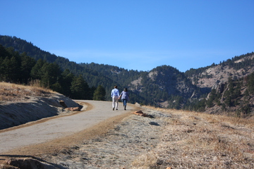

# Lyons, Colorado &mdash; 19 August 2018

  

    Boulder servirá de base para la celebración en Colorado, y les sugerimos que se
    hospeden allí. La ceremonia se llevará acabo en Lyons, un pueblito que queda a
    sólo 30 minutos al norte de Boulder, entre Boulder y Estes Park.  (Estes Park es
    un pueblito que queda a la entrada del Parque Nacional de las Montañas Rocosas y
    también pueden considerar alojarse allí.) Tendremos transporte hacia y desde
    Lyons el 19 de agosto.
  

  

    Boulder will be our home base for the Colorado celebration, and we encourage you
    to stay in town! Lyons is just 30 minutes north of Boulder, and halfway in
    between Boulder and Estes Park. (Estes Park is home to Rocky Mountain National
    Park, and also an option to consider when seeking accommodations.) We will have
    shuttles to and from Lyons on the 19th.
  

  

  <h3>Dónde hospedarse?</h3>

Para su conveniencia hemos convenido descuentos con los siguientes hoteles en
Boulder. El transporte hasta el lugar de la ceremonia saldrá y volverá de estos
hoteles.

Si prefieren también hay buenas opciones en Airbnb.

  

  

  <h3>Where to stay?</h3>

We arranged discounts with the following hotels. The shuttles on the 19th will
depart from and return to these hotels.

If you prefer, there are also many great options on Airbnb.

  

  * Boulder Marriott, 2660 Canyon Blvd, [book here](http://www.marriott.com/meeting-event-hotels/group-corporate-travel/groupCorp.mi?resLinkData=Silva/Stechschulte%20Wedding%20%5Edenbo%60sdssdsg%7Csdssdsq%60249%60USD%60false%604%608/18/18%608/20/18%607/18/18&app=resvlink&stop_mobi=yes)
  * Hilton Garden Inn, 2701 Canyon Blvd, [discount code N0110175](https://secure3.hilton.com/en_US/gi/reservation/book.htm?ctyhocn=WBUBOGI&corporateCode=N0110175&from=lnrlink)
  * Embassy Suites, 2601 Canyon Blvd, [discount code 0560061264](https://secure3.hilton.com/en_US/es/reservation/book.htm?ctyhocn=DENBOES&corporateCode=0560061264&from=lnrlink)
  * Courtyard Boulder, 4710 Pearl East Circle, $189/night. Call Marriott
    Reservations, 800-321-2211 or 303-440-4700 and identify yourself as part of
    the John Stechschulte group.

  

<h3>Información de viaje</h3>

El aeropuerto internacional de Denver (DEN) queda a 45 minutos de Boulder. No
hay vuelos directos desde Bogotá a Denver. Recomendamos hacer escala en Atlanta,
Houston o Miami.

El tiempo aproximado de vuelo entre estas cuidades y Denver esta detallado aquí:
<ul><li>Atlanta &mdash; 3.5 horas</li>
<li>Houston &mdash; 2.5 horas</li>
<li>Miami &mdash; 5 horas</li></ul>

Hay un bus muy conveniente entre Boulder y el aeropuerto.  Boulder se puede
recorrer a pie o en bus.

  

  

<h3>Travel Information</h3>

Denver International Airport is 45 minutes from Boulder. There is a good bus
option to get to Boulder from the airport, and Boulder is easy to navigate by
foot and bus.

  

 
<iframe class="center" src="https://www.google.com/maps/d/u/0/embed?mid=1lNfEtOiYplbtDldmj3O60nNCTz0Ro1ys" width="640" height="480"></iframe>
